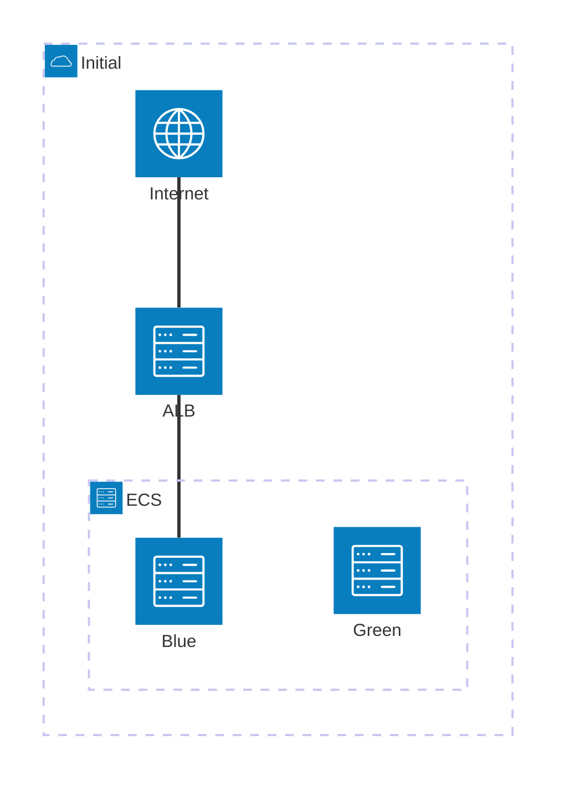
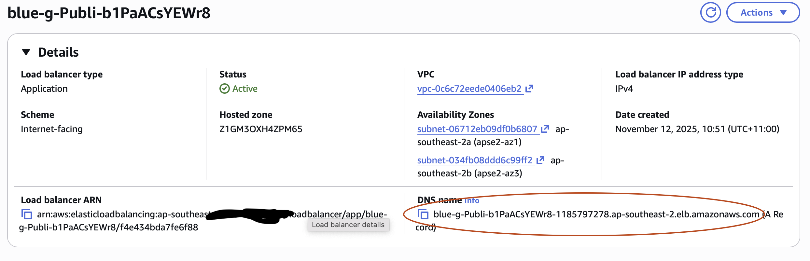
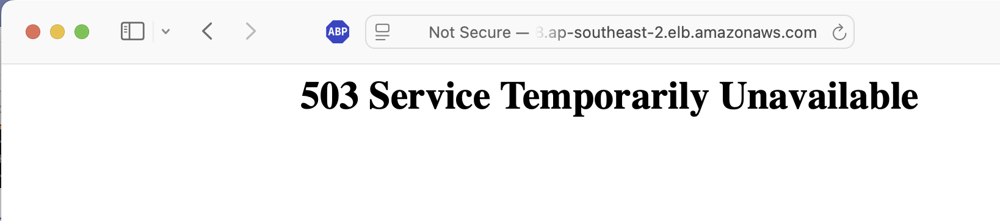
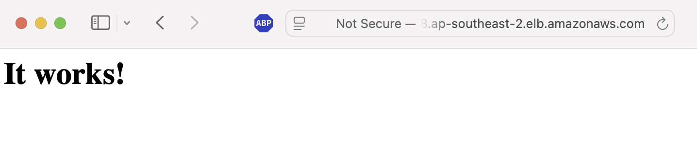
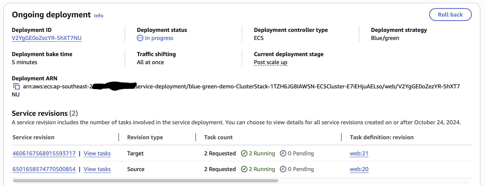

# Blue/Green ECS Deployments

Amazon announced earlier this year that [ECS now supports Blue/Green deployments](https://aws.amazon.com/blogs/aws/accelerate-safe-software-releases-with-new-built-in-blue-green-deployments-in-amazon-ecs/) natively. Why is this a big deal?

## What is Blue/Green Deployment?

An application deployment typically involves stopping the currently running version of an application, updating the software, and then restarting the application. This means downtime, where the application is unavailable for a period of time. It also means that in the event that the new version doesn't work rolling back to the previous version will mean re-deploying the old version. There are ways to minimise this downtime and make rollbacks easier. You won't be surprised to learn that blue-green deployments are one of those ways.

In a blue-green deployment, the currently running application is deemed the "blue" version. The new version to be deployed is the "green" version. The green version is deployed into its own infrastructure, so that blue and green are running simultaneously. This allows the green version to be tested while production traffic is still being handled by the blue version. If testing succeeds, the traffic is pointed to the green version. The blue version is then shut down, and green becomes the new blue. If testing the green version fails, nothing needs to be done - the blue version is still serving traffic and nobody needs to know of the shameful green version debacle. Zero downtime, easy rollbacks. The downside is temporarily needing more resources and capacity while both versions are running.




In ECS, a deployment usually means a new version of a container used by a service or task. With a standard deployment, the old container is stopped and the new one started, with a period of interrupted service in between. In a blue/green deployment, both containers run for a period of time with AWS handling the movement of traffic from the blue to the green.

## Couldn't you already do this with CodeDeploy?

[AWS CodeDeploy](https://docs.aws.amazon.com/codedeploy/latest/userguide/welcome.html) does have the ability to perform blue/green deployments in ECS, and until recently was the only way supported by AWS. If you didn't want to use CodeDeploy, for your own reasons (none of my business), then you were pretty much out of luck on ECS. You could do blue-green with EKS, but that brings with it a whole lot more complexity.

## How to set it up in an existing ECS service

### Step 1: set up an existing ECS service

Let's assume you've got an existing service in ECS that you want to use with the blue-green deployment strategy. For this example, we've got a [simple ECS Fargate cluster](https://containersonaws.com/pattern/public-facing-web-ecs-fargate-cloudformation) deployed in a [VPC's public subnet](https://containersonaws.com/pattern/low-cost-vpc-amazon-ecs-cluster). The cluster is running a container with nginx - think of it as the web frontend for an application. The cloud formation scripts to set this up are in [this repository](https://github.com/shinesolutions/ecs-blue-green-demo), and you can deploy them easily with [AWS' Serverless Application Model CLI](https://docs.aws.amazon.com/serverless-application-model/latest/developerguide/install-sam-cli.html). Checkout the repo, install and setup SAM, authenticate with AWS and then you can deploy the basic stack like this:

```shell
sam deploy --template-file stack.yaml --stack-name blue-green-demo
```

(Note: You can call your stack whatever you like, you don't have to use blue-green-demo).

Once that's finished, in AWS console, you can navigate to the Application Load Balancer that was created as part of the stack. There you can find the public DNS name of our web frontend.



Paste that into your browser, and you should see the nginx welcome page.


So for this stack, if we deploy an updated container ECS will stop the currently running service before starting up the new one. This will mean an outage while the new service starts up. You can test this scenario out yourself by editing [stack.yaml](stack.yaml). Uncomment the last line, so that the parameters for the service look like this:

```yaml startline=27
      Parameters:
        VpcId: !GetAtt VpcStack.Outputs.VpcId
        PublicSubnetIds: !GetAtt VpcStack.Outputs.PublicSubnetIds
        ClusterName: !GetAtt ClusterStack.Outputs.ClusterName
        ECSTaskExecutionRole: !GetAtt ClusterStack.Outputs.ECSTaskExecutionRole
        ImageUrl: public.ecr.aws/docker/library/httpd:latest
```

This will change the container image used for the service from nginx to Apache HTTPD. Deploy this using the `sam deploy` command you used before. Refreshing the ALB URL from earlier during the deployment you might see a HTTP 503 error page that says "Service Unavailable" while the nginx version is stopped and the Apache version is being started - but you'll have to be pretty quick, as both services stop and start quite quickly.



Once the new version of the service has started, you should see the Apache welcome page.



That 503 error (that you might not even have managed to see) is what we're going to avoid by using a blue-green strategy.

### Step 2: Add in the things we need to support blue-green deployments

To enable blue-green deployments we have to give ECS permission to manage traffic to our cluster, in our case via the ALB rules. You can also do the same things if you're using a [Network Load Balancer](https://docs.aws.amazon.com/AmazonECS/latest/developerguide/nlb-resources-for-blue-green.html), or [Service Connect](https://docs.aws.amazon.com/AmazonECS/latest/developerguide/nlb-resources-for-blue-green.html), but for our example we will focus on the [ALB rules](https://docs.aws.amazon.com/AmazonECS/latest/developerguide/alb-resources-for-blue-green.html).

During the deployment, ECS will need to move traffic from our runnning blue service to our new green service. In the case of a rollback, it would also need to move traffic back to the blue one. To give ECS control over the load balancer, we add this IAM role to our service stack:

```yaml
  ECSManageLoadBalancersRole:
    Type: AWS::IAM::Role
    Properties:
      AssumeRolePolicyDocument:
        Statement:
          - Effect: Allow
            Principal:
              Service: [ecs.amazonaws.com]
            Action: ["sts:AssumeRole"]
      ManagedPolicyArns:
        - arn:aws:iam::aws:policy/AmazonECSInfrastructureRolePolicyForLoadBalancers
```

AWS already provide a policy that covers the permissions that ECS needs (that's the managed policy in the snippet above).

We're also going to need two target groups for the load balancer instead of just the one we had before. One will be for the blue service, and the other for the green.

```yaml
  BlueTargetGroup:
    Type: AWS::ElasticLoadBalancingV2::TargetGroup
    Properties:
      HealthCheckIntervalSeconds: 6
      HealthCheckPath: /
      HealthCheckProtocol: HTTP
      HealthCheckTimeoutSeconds: 5
      HealthyThresholdCount: 2
      TargetType: ip
      Port: !Ref ContainerPort
      Protocol: HTTP
      UnhealthyThresholdCount: 10
      VpcId: !Ref VpcId
      TargetGroupAttributes:
        - Key: deregistration_delay.timeout_seconds
          Value: 0

  GreenTargetGroup:
    Type: AWS::ElasticLoadBalancingV2::TargetGroup
    Properties:
      HealthCheckIntervalSeconds: 6
      HealthCheckPath: /
      HealthCheckProtocol: HTTP
      HealthCheckTimeoutSeconds: 5
      HealthyThresholdCount: 2
      TargetType: ip
      Port: !Ref ContainerPort
      Protocol: HTTP
      UnhealthyThresholdCount: 10
      VpcId: !Ref VpcId
      TargetGroupAttributes:
        - Key: deregistration_delay.timeout_seconds
          Value: 0
```

They're pretty much exactly the same, and also the same as the previous single target group we had before. Important to note are the health check settings, since ECS will use those health checks to decide if your new green service is ready to accept traffic. It's worth making sure that your health checks actually reflect that your application is ready to serve requests if you want to avoid errors. It's no good having a health check that returns "OK" without checking that the app can connect to the database, for example.

Now we need to let the ALB know about the two target groups. We modify the default rule to point to the blue target group.

```yaml
  PublicLoadBalancerListener:
    Type: AWS::ElasticLoadBalancingV2::Listener
    Properties:
      DefaultActions:
        - Type: "forward"
          ForwardConfig:
            TargetGroups:
              - TargetGroupArn: !Ref BlueTargetGroup
                Weight: 100
      LoadBalancerArn: !Ref "PublicLoadBalancer"
      Port: 80
      Protocol: HTTP
```

Then we need to add an extra rule that ECS will use to swap traffic between the two groups.

```yaml
  PublicLoadBalancerListenerRule:
    Type: "AWS::ElasticLoadBalancingV2::ListenerRule"
    Properties:
      ListenerArn: !Ref PublicLoadBalancerListener
      Priority: 20
      Conditions:
        - Field: http-header
          HttpHeaderConfig:
            HttpHeaderName: User-Agent
            Values:
              - "*"
      Actions:
        - Type: forward
          ForwardConfig:
            TargetGroups:
              - TargetGroupArn: !Ref BlueTargetGroup
                Weight: 100
              - TargetGroupArn: !Ref GreenTargetGroup
                Weight: 0
```

This one might seem a little weird - a conditional rule that regardless of the value of the "User-Agent" HTTP header always sends the request to the blue target group. The condition is there because a listener rule has to have a condition. The two target groups are included so that ECS can change the weight values between the two when it needs to move the traffic over.

The final step is to let ECS know we want it to use the blue-green deployment strategy. We change the load balancers section of the service definition to add the extra information about the blue and green target groups:

```yaml
      LoadBalancers:
        - ContainerName: !Ref ServiceName
          ContainerPort: !Ref ContainerPort
          TargetGroupArn: !Ref BlueTargetGroup
          # Add a section here to point to the second target group
          AdvancedConfiguration:
            AlternateTargetGroupArn: !Ref GreenTargetGroup
            ProductionListenerRule: !Ref PublicLoadBalancerListenerRule
            RoleArn: !GetAtt ECSManageLoadBalancersRole.Arn
```

Note the reference to the listener rule we added, and the IAM role that allows ECS to modify that listener rule. Now we just need to add a section to the end of the service definition telling ECS to use the blue-green strategy.

```yaml
      DeploymentConfiguration:
        Strategy: BLUE_GREEN
        MaximumPercent: 200
        MinimumHealthyPercent: 75
        BakeTimeInMinutes: 5
```

The "BakeTimeInMinutes" parameter specifies how long both blue and green services are kept running after the traffic has shifted to the green service. During this period, rolling back to the blue service is as easy as clicking the rollback button in the AWS console. The listener rule will be changed to point back to the blue with no interruption in service. After the bake time has elapsed, the blue service will be terminated and the green service becomes the new "blue". As both services will be running during the bake time, you need to make sure that your cluster has the resources for both (at least temporarily).

### Step 3: Test it out

To test this out, edit the ServiceStack section in [stack.yaml](stack.yaml) to look like this:

```yaml
  ServiceStack:
    Type: AWS::Serverless::Application
    Properties:
      # Location: service.yaml
      Location: blue-green-service.yaml
      Parameters:
        VpcId: !GetAtt VpcStack.Outputs.VpcId
        PublicSubnetIds: !GetAtt VpcStack.Outputs.PublicSubnetIds
        ClusterName: !GetAtt ClusterStack.Outputs.ClusterName
        ECSTaskExecutionRole: !GetAtt ClusterStack.Outputs.ECSTaskExecutionRole
        # ImageUrl: public.ecr.aws/docker/library/httpd:latest
```

We've replaced the [service yaml](service.yaml) with the [blue-green version](blue-green-service.yaml), and also commented out the ImageUrl parameter - taking us back to the original nginx web server. We can deploy it with the sam command:

```shell
sam deploy --template-file stack.yaml --stack-name blue-green-demo
```

This time you'll notice that the deployment doesn't finish when all the resources are created. The command will wait for the 5 minutes "bake time" we configured. During this time you can rollback in the AWS console.



Refreshing the load balancer URL from earlier, you should see the Apache welcome page (the "blue" service) while the green is being deployed. However, because this first time requires a few extra resources to be set up (the IAM role, target groups, ALB rules) there will be a period where you will see that 503 error. Once the green service responds to a health check request, ECS will move the traffic to the green and refreshing the page will show you the nginx welcome page. For a proper test of the blue-green strategy, where you don't see the 503 error, try re-deploying (just uncomment that ImageUrl to re-deploy the Apache version). You should not have a period in between which returns a 503 error.

Don't forget to shut down all the resources when you're done testing.

```shell
sam delete
```


## Deployment hooks and how to do something a bit more complicated

The strategy above is the simplest blue-green deployment that can be set up in ECS. What if you want to have a testing period where access to the green service is only available to testers, and the blue continues to serve traffic until the testers give the thumbs-up? Or what if you want a gradual movement of traffic from blue to green instead of an all-in-one transfer? For these kinds of scenarios, ECS provides deployment hooks and two other deployment strategies.

At [different stages of the blue-green deployment](https://docs.aws.amazon.com/AmazonECS/latest/developerguide/blue-green-deployment-how-it-works.html#blue-green-deployment-stages), ECS can call out to lambda functions. The deployment will pause until those lambdas return a response indicating that either everything is fine, or that a rollback should occur. So for the testing scenario above, you could add a lambda at the POST_TEST_TRAFFIC_SHIFT step - this is when the green service is running, but the blue service is still handling 100% of the production traffic. The lambda could wait for a signal from the testing team (a file placed in a S3 bucket, a message on a queue), not allowing the deployment to proceed until that signal was received. For a complete example of how to set this up, AWS have provided a [sample architecture](https://github.com/aws-samples/sample-amazon-ecs-blue-green-deployment-patterns/blob/main/ecs-bluegreen-lifecycle-hooks/README.md).

Amazon have also [recently announced support for linear and canary deployment](https://aws.amazon.com/about-aws/whats-new/2025/10/amazon-ecs-built-in-linear-canary-deployments/) strategies. These are variants of blue-green, where the traffic is shifted gradually from blue to green in the case of [linear](https://docs.aws.amazon.com/AmazonECS/latest/developerguide/deployment-type-linear.html), or a proportion of traffic will be sent to the green for a period of time in the case of [canary deployments](https://docs.aws.amazon.com/AmazonECS/latest/developerguide/canary-deployment.html) (the idea being similar to the [canary-in-the-coalmine](https://www.smithsonianmag.com/smart-news/what-happened-canary-coal-mine-story-how-real-life-animal-helper-became-just-metaphor-180961570/) testing for gas leaks). The setup and resources needed for these strategies is very similar to blue-green, so setting these up should be reasonably straightforward if you've followed what we've done so far.

## References

* [ECS Cluster architecture and sample CF template](https://containersonaws.com/pattern/public-facing-web-ecs-fargate-cloudformation)
* [Simple VPC (public subnets only) CF template](https://containersonaws.com/pattern/low-cost-vpc-amazon-ecs-cluster)
* [SAM CLI](https://docs.aws.amazon.com/serverless-application-model/latest/developerguide/install-sam-cli.html)
* [Sample stack with manual approval step and gradual traffic movement from blue to green](https://github.com/aws-samples/sample-amazon-ecs-blue-green-deployment-patterns/blob/main/ecs-bluegreen-lifecycle-hooks/README.md)
* [Linear deployment strategy in ECS](https://docs.aws.amazon.com/AmazonECS/latest/developerguide/deployment-type-linear.html)
* [Canary deployment strategy in ECS](https://docs.aws.amazon.com/AmazonECS/latest/developerguide/canary-deployment.html)

